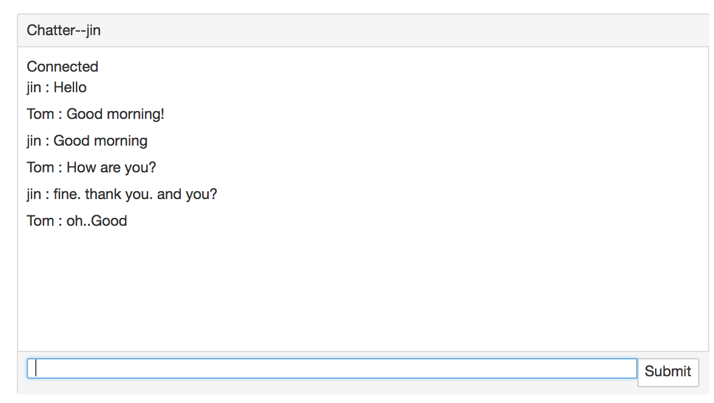
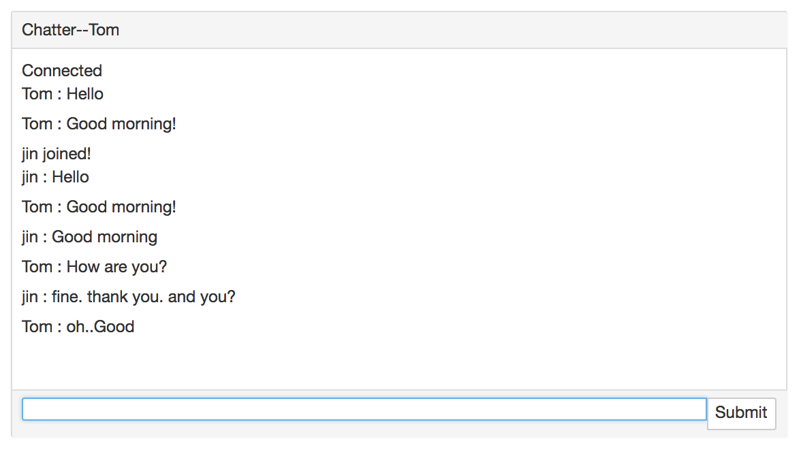
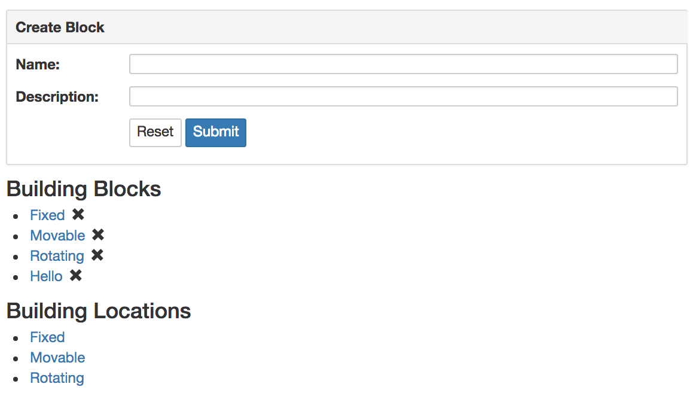

## Chat Demo

need package: socket.io@.9.19 express

```js
var app=express();
var server = require('http').Server(app);
var io=socket.listen(server);
server.listen(1337);
```

### 01.js

code:
- 01.html (Client)
- 01.js (Server)

```
node 01.js
```

Open 2 Client to visit URL: `http://localhost:1337`




## Express Demo

need package: express
屏幕快照 2018-08-19 下午9.35.03.png
```js
var express=require("express");
var app=express();

app.use(express.static("public"));
...

app.listen(1337,function(){
	console.log("Listen on port 1337");
});
```




### 02.js

code:
- 02.js


```
node 02.js
```

visit:
	http://localhost:1337

```
get 	/			"Hello world"

get 	/blocks		["Fixed","Movable","Rotating"]
get 	/blocks2	["Fixed","Movable","Rotating"]
get 	/block3		<ul><li>Fixed</li><li>Movable</li><li>Rotating</li></ul>

get 	/go			302 -> index.html
get 	/go2		301 -> index.html
```


### 03.js

code:
- public/index.html
- 03.js
- logger.js

```
node 03.js
```

visit:
	http://localhost:1337

```
get 	/

get 	/blocks				["Fixed","Movable","Rotating","Sdfjd","Hello"]
get 	/blocks/:name
post 	/blocks
delete 	/blocks/:name

get /locations				["Fixed","Movable","Rotating"]
get /locations/:name
```

 *post*

- index.html (Client):
	```js
	var blockForm=$("#blockForm");
	blockForm.on("submit",function(event){
		event.preventDefault();
		var blockData=blockForm.serialize();
		$.ajax({
			type:'POST',url:'/blocks',data:blockData
		}).done(function(data){
			appendToList(data);
			blockForm.trigger('reset');
		});
	});
	```

- 03.js (Server):
	```js
	var bodyParser=require("body-parser");
	var parseUrlencoded=bodyParser.urlencoded({extended:false});
	app.post("/blocks",parseUrlencoded,function(req,res){
		var newBlock=req.body;
		var newBlockName=newBlock.name;
		newBlockName=newBlockName[0].toUpperCase()+newBlockName.slice(1).toLowerCase();
		blockMap[newBlockName]=newBlock.description;
		res.status(201).json(newBlockName);
	});
	```

- Request:
	```
	Content-Type: application/x-www-form-urlencoded; charset=UTF-8
	Form Data: name=Hello&description=World
	```
- Response:
	```
	Status Code: 201 Created
	Content-Type: application/json; charset=utf-8
	```


## Route Demo


### 04.js

code:
- public/index.html
- 04.js


```
node 04.js
```

visit: same with 03.js

```
app.route(url)
.get(function(req,res){
	
})
.post(function(req,res){
	
});
```

### 05.js

code:
- public/index.html
- 05.js
- routes/blocks.js  - export as a node module

```
node 05.js
```

visit:
```
get 	/

get 	/blocks				["Fixed","Movable","Rotating","Sdfjd","Hello"]
get 	/blocks/:name
post 	/blocks
delete 	/blocks/:name
```


